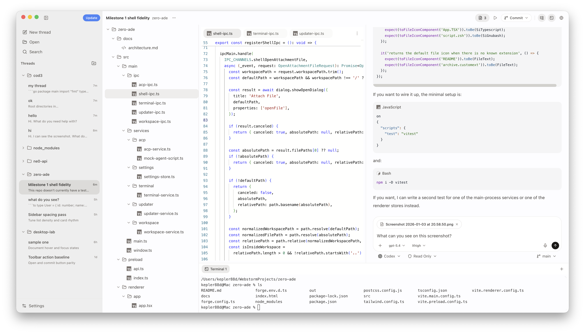

# Zero

Zero is a desktop AI coding workspace built with Electron + React + TypeScript.
It combines chat-first workflows with ACP-based agent orchestration, workspace tools, and a modern desktop shell.

Website: [zeroade.dev](https://zeroade.dev)



## What You Get

- Multi-agent ACP support (Codex, Claude Code, and custom/registry agents)
- In-app agent auth and connection handling
- Shared per-thread history when switching agents
- New-thread landing with quick suggestions
- Voice input in composer (click to toggle, `Ctrl+M` hold-to-talk)
- File tree + review panel with Monaco editor
- Integrated terminal panel and update flow

## Requirements

- Node.js 20+
- npm 10+
- macOS recommended for native titlebar/window parity

## Run Locally

```bash
npm install
npm run start
```

## Useful Commands

```bash
npm run lint
npm run package
npm run make
npm run make:mac:arm64
```

## Auto Update Setup

By default, update checks use `package.json -> repository.url`.

If you want to override it at runtime, set:

```bash
export ZEROADE_UPDATE_REPOSITORY_URL="https://github.com/egor-baranov/zero-ade"
```

## GitHub macOS Build + Release

This repo includes a GitHub Actions workflow at:

`/.github/workflows/release-macos-arm64.yml`

What it does on tag push (`v*`):

- Builds macOS Apple Silicon (`arm64`) with Electron Forge
- Generates `latest-mac.yml` + `Zero-darwin-arm64.zip` for `electron-updater`
- Uploads both files to the GitHub Release

Release flow:

```bash
git tag v1.0.1
git push origin v1.0.1
```

The release assets from that tag can be linked directly from your website, and the packaged app can auto-update from GitHub Releases.

Website download button targets:

- Latest macOS Apple Silicon zip: `https://github.com/egor-baranov/zero-ade/releases/latest/download/Zero-darwin-arm64.zip`
- Releases page: `https://github.com/egor-baranov/zero-ade/releases/latest`

## Tech Stack

- Electron Forge + Vite
- React 19 + TypeScript
- Tailwind CSS + Radix UI
- ACP SDK (`@agentclientprotocol/sdk`)
- Monaco Editor

## Project Layout

```text
src/
  main/        # Electron main process, IPC, ACP services
  preload/     # secure typed bridge
  renderer/    # UI, features, state stores
  shared/      # shared contracts/types
```
